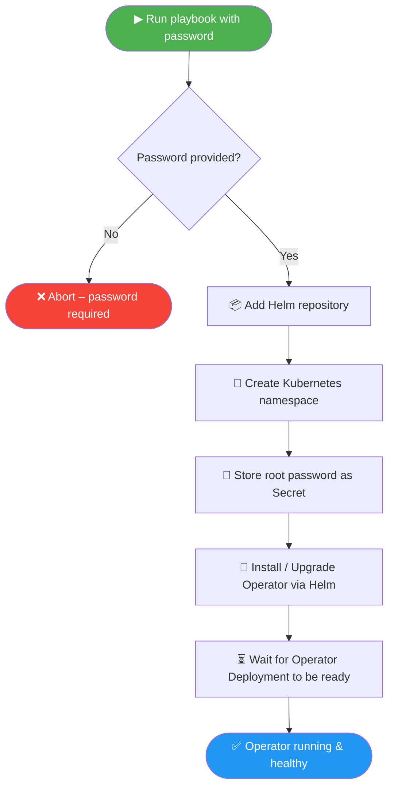

# MariaDB Operator – Automated Database Deployment

## What Does This Playbook Do? (Plain-English Summary)

Imagine you have a **large fleet of servers** (a Kubernetes cluster) and you want to run
a **database service** (MariaDB) on them. Setting that up by hand would mean dozens of
manual steps: creating accounts, installing software, wiring up passwords, and checking
that everything came up healthy.

**This playbook automates all of that in one command.**

Think of it like a recipe card that a robot chef follows every time, exactly the same
way, so you never get a "works on my machine" surprise.

### In everyday terms the playbook does five things

| Step | What happens | Why it matters |
|------|-------------|----------------|
| **1. Safety check** | Verifies the required database password was provided | Prevents accidental deployment with no password |
| **2. Register the software catalogue** | Tells Kubernetes where to download the MariaDB Operator package (a Helm chart) | Like adding a new app store so the system knows where to find the installer |
| **3. Prepare a workspace** | Creates a dedicated area (namespace) inside the cluster | Keeps MariaDB files separate from everything else — like giving it its own folder |
| **4. Store the password securely** | Saves the root database password as an encrypted secret inside the cluster | The password never sits in plain text on disk or in logs |
| **5. Install (or upgrade) the Operator** | Deploys the MariaDB Operator software and waits until it reports "ready" | The Operator then watches for you to request databases and manages them automatically |

Once the Operator is running, you (or another playbook) can ask it to spin up actual
database instances — the playbook includes a *disabled-by-default* example of that
(`example-mariadb`).

### What is an "Operator"?

An Operator is a small program that lives inside Kubernetes and acts like a **dedicated
database administrator on autopilot**. It watches for requests ("I need a database with
1 GB of storage") and handles creation, backups, scaling, and recovery — all without
human intervention.

---

## Workflow Visualisation

### High-level flow

```
┌─────────────────┐
│  You run the     │
│  playbook with   │
│  a password      │
└────────┬────────┘
         │
         ▼
┌─────────────────┐     ╔══════════════════╗
│ 1. Safety Check │────▶║ Password missing? ║──▶ STOP with error
│    (pre_task)   │     ║    Yes            ║
└────────┬────────┘     ╚══════════════════╝
         │ No
         ▼
┌─────────────────┐
│ 2. Add Helm     │  Register the "app store" URL so Kubernetes
│    Repository   │  can download the MariaDB Operator package.
└────────┬────────┘
         │
         ▼
┌─────────────────┐
│ 3. Create       │  Make sure the dedicated workspace
│    Namespace    │  (mariadb-operator) exists.
└────────┬────────┘
         │
         ▼
┌─────────────────┐
│ 4. Store Root   │  Save the database root password as an
│    Password     │  encrypted Kubernetes Secret.
│    (Secret)     │
└────────┬────────┘
         │
         ▼
┌─────────────────┐
│ 5. Install /    │  Deploy (or upgrade) the MariaDB Operator
│    Upgrade      │  via its Helm chart and wait for it
│    Operator     │  to become healthy.
└────────┬────────┘
         │ triggers handler
         ▼
┌─────────────────┐
│ 6. Wait for     │  Confirm the Operator pod is running
│    Readiness    │  and has the expected number of replicas.
└────────┬────────┘
         │
         ▼
       ✅ Done!
```

### Mermaid diagram (renders on GitHub / GitLab)



---

## Quick-Start Guide

### Prerequisites

| Tool | Purpose |
|------|---------|
| **Ansible ≥ 2.12** | Runs the playbook |
| **Helm 3** | Installs the Operator chart |
| **kubectl** | Talks to Kubernetes |
| **A Kubernetes cluster** | Where everything gets deployed |

### 1. Install required Ansible collections

```bash
ansible-galaxy collection install community.kubernetes kubernetes.core
```

### 2. Create an encrypted password file

```bash
# Create a vault-encrypted file that stores your database root password
ansible-vault create vault.yml
# Inside the editor that opens, write:
#   mariadb_root_password: "YourSuperSecretPassword"
```

### 3. Run the playbook

```bash
# Install or upgrade the Operator
ansible-playbook playbook.yml \
  -e @vault.yml \
  --ask-vault-pass

# Uninstall the Operator (removes Helm release)
ansible-playbook playbook.yml \
  -e @vault.yml \
  -e state=absent \
  --ask-vault-pass
```

---

## File Structure

```
mariadb-operator/
├── README.md              ← You are here – full explanation & diagrams
├── playbook.yml           ← The main automation (heavily commented)
├── vault.yml.example      ← Template showing what goes in your encrypted vault
├── inventory/
│   └── hosts              ← Ansible inventory (localhost only)
└── docs/
    └── glossary.md        ← Jargon-buster for non-technical readers
```

---

## Lifecycle Modes

The playbook supports two modes controlled by the `state` variable:

| `state` value | What happens |
|---------------|-------------|
| `present` *(default)* | Installs or upgrades the Operator; creates namespace and secret |
| `absent` | Uninstalls the Helm release (removes the Operator from the cluster) |

---

## Security Notes

- The root password **must** be encrypted with `ansible-vault` — never commit it in
  plain text.
- The password is stored inside the cluster as a Kubernetes `Secret` (base-64 encoded,
  access-controlled by RBAC).
- The playbook uses `stringData` so the password value is encrypted *in transit* from
  your vault file into the cluster, but never written to disk unencrypted.
