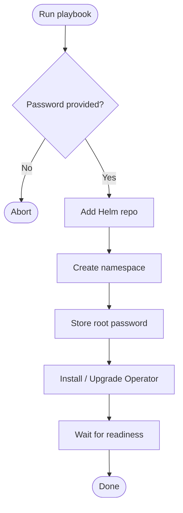

# MariaDB Operator Playbook

Ansible playbook that installs (or removes) the [MariaDB Operator](https://github.com/presslabs/mysql-operator) on a Kubernetes cluster via Helm.

## What it does

1. Checks you actually provided a root password
2. Registers the Presslabs Helm repo
3. Creates the `mariadb-operator` namespace
4. Stores the root password as a K8s Secret
5. Installs/upgrades the Operator and waits for it to come up healthy

Set `state: absent` to tear it down instead.

## Workflow



## Quick start

Prerequisites: **Ansible ≥ 2.12**, **Helm 3**, **kubectl**, a running cluster.

```bash
# one-time: install Ansible collections
ansible-galaxy collection install community.kubernetes kubernetes.core

# create an encrypted password file
ansible-vault create vault.yml
#   mariadb_root_password: "YourPassword"

# deploy
ansible-playbook playbook.yml -e @vault.yml --ask-vault-pass

# uninstall
ansible-playbook playbook.yml -e @vault.yml -e state=absent --ask-vault-pass
```

## Repo layout

```
playbook.yml           – the playbook (commented)
vault.yml.example      – template for the encrypted vault
inventory/hosts        – Ansible inventory (localhost)
docs/glossary.md       – plain-English definitions of every term used
docs/workflow.html     – interactive visual walkthrough (open in a browser)
```

## Security

- Root password **must** come from `ansible-vault` — don't commit it in plain text.
- Inside the cluster it lives in a K8s Secret (base-64 encoded, RBAC-controlled).
